# Provenance-adaptive conformal ranking for honest dual-target drug repurposing from public bioactivity data

**Application to the IDO1/TDO2 tryptophan-catabolising checkpoints**

**Xiyao Yu**

School of Chemistry, Chemical Engineering and Biotechnology, Nanyang Technological University, Singapore

*Preprint — working draft (revised)*

---

## Abstract

Public bioactivity databases pool measurements across papers, laboratories and assay contexts, yet repurposing models are usually validated as if these measurements were IID. We introduce Provenance-Adaptive Conformal Ranking (PACR), a source-document-aware uncertainty layer for dual-target repurposing from heterogeneous public bioactivity data, and apply it to IDO1/TDO2. We reparametrised 684 co-tested compounds into shared potency *M* and selectivity imbalance *D*, then evaluated random-forest regressors under random, scaffold, temporal and leave-document-out splits. Random/scaffold validation suggested useful skill, but leave-document-out validation over 44 source documents collapsed performance to approximately zero, identifying source-document shift as the dominant deployment risk. Split-conformal lower-bound ranking rejected the apparent approved-drug hit list: among 2,387 approved drugs, no compound cleared a confident dual-active bound of pActivity ≥ 6. PACR learns a conservative provenance-aware scale from proper-train leave-document-out residuals, applies conformal calibration on a separate calibration fold, and further penalises compounds unsupported by the training documents' chemical domains without changing the negative verdict. Separately, the measured IDO1/TDO2 inhibitor overlap is moderately positive (Pearson *r* = 0.43, 95% CI 0.36–0.49), indicating that dual engagement is chemically accessible even though no approved drug is confidently supported for repurposing. Replication on COX-1/COX-2 supports the paired-target validation workflow outside the IDO1/TDO2 case.

**Keywords:** drug repurposing, IDO1, TDO2, melanoma immunotherapy, QSAR, scaffold splitting, applicability domain, conformal prediction, leave-document-out validation, matched molecular pairs, dual-target inhibition

---

## 1. Introduction

Tumours evade immune destruction in part by metabolic means. Two haem-containing dioxygenases, IDO1 and TDO2, catalyse the conversion of L-tryptophan to N-formylkynurenine — the committed step of the kynurenine pathway [2]. The dependence of both enzymes on an iron–porphyrin cofactor is central to their mechanism [6]; the structural analysis below therefore uses a haem-containing IDO1 crystal structure so that the docked pocket reflects the catalytically relevant active site. Local tryptophan depletion and kynurenine accumulation together suppress effector T-cell function, promote regulatory T-cell differentiation, and engage the aryl-hydrocarbon receptor, establishing an immunosuppressive tumour microenvironment [3,4]. In melanoma, IDO1 expression is associated with poor prognosis, which made pharmacological IDO1 inhibition an attractive immuno-oncology strategy [2,3].

That strategy has largely disappointed in the clinic. Most IDO1 inhibitors show limited single-agent efficacy, and the pivotal ECHO-301/KEYNOTE-252 trial of epacadostat plus pembrolizumab did not improve outcomes over pembrolizumab alone in advanced melanoma [1]. Rather than invalidating the target, this outcome reframed the problem: the current questions are whether IDO1 blockade can be productively **combined** with other agents, and whether compensatory **TDO2** activity undermines single-enzyme inhibition — motivating interest in dual IDO1/TDO2 inhibitors [5].

Computational drug repurposing is well matched to these questions. Approved drugs carry established human safety and pharmacokinetic profiles, and both the chemical matter and the bioactivity data are public. The principal methodological hazard is **evaluation optimism**: a quantitative structure–activity (QSAR) model tested with random train/test splitting is rewarded for recognising close analogs of training compounds and therefore overstates how well it transfers to structurally novel drugs — exactly the regime a repurposing screen operates in. We address this throughout with scaffold-based evaluation and an applicability-domain filter, and we extend the analysis to TDO2 to place the IDO1 results in a cross-target, selectivity-aware context.

We therefore introduce **Provenance-Adaptive Conformal Ranking (PACR)** as the methodological core of the paper. PACR is not a new QSAR architecture; it is a conservative ranking layer for public bioactivity data where the main threat is source-document shift. The framework has three pieces: paired-target reparametrisation into shared potency and selectivity imbalance, source-document validation to expose whether scaffold performance survives transfer to a new publication, and conformal lower-bound ranking whose interval scale can incorporate model uncertainty, chemical distance and document-domain distance. The IDO1/TDO2 application is the stress test: if the data support a confident approved-drug dual hit, the lower bound should find it; if they do not, the method should return an honest negative rather than a persuasive-looking shortlist.

---

## 2. Methods

### 2.1 Targets and bioactivity data
Human IDO1 (ChEMBL target CHEMBL4685) and TDO2 (CHEMBL2140) bioactivities were retrieved from the **live ChEMBL REST API** (`https://www.ebi.ac.uk/chembl/api/data/activity`) in June 2026, with full pagination over the activity endpoint [7]; the query was against the then-current live database rather than a pinned static release, and the retrieval date should be cited for reproducibility. Endpoints IC50, Ki, Kd and EC50 were pulled (7,634 IDO1 and 1,684 TDO2 records; together the raw records span 2006–2025). Inhibition/binding endpoints (IC50/Ki/Kd) were retained where `standard_relation = '='`, `standard_units = 'nM'`, and `standard_value > 0`; rows with a non-empty `data_validity_comment` (e.g. "outside typical range", "potential author error") were removed. Potency was expressed as pActivity = −log₁₀(value in M) and aggregated to one median value per molecule across all retained measurements. Because most retained records are IC50 measurements, activity thresholds are reported on the pIC50-equivalent scale for readability.

### 2.2 Chemistry curation
SMILES were canonicalised with RDKit (release 2023.09) [13]; salts and mixtures were reduced to the largest organic fragment with the RDKit `LargestFragmentChooser`, and structures deduplicated on canonical SMILES. Pan-assay interference substructures were flagged with the RDKit `FilterCatalog` PAINS catalogue (PAINS_A, PAINS_B and PAINS_C SMARTS sets) [9]. Curation produced **3,585 IDO1 compounds** (1,361 Bemis–Murcko scaffolds [8]; median pActivity 6.52) and **964 TDO2 compounds** (356 scaffolds; median pActivity 6.01). Per compound we computed nine physicochemical descriptors (MW, cLogP, TPSA, H-bond donors/acceptors, rotatable bonds, aromatic rings, fraction sp³ C, QED) and 2,048-bit radius-2 Morgan (ECFP4-equivalent) fingerprints [10].

### 2.3 Models and leakage-safe evaluation
For each target a random-forest classifier (active = pActivity ≥ 6, i.e. ≤ 1 µM on the pIC50-equivalent scale) and a random-forest regressor were trained on the Morgan fingerprints [11,12]. Both used 500 trees with a fixed seed (`random_state = 0`); the classifier used `max_features = 'sqrt'` and `class_weight = 'balanced'` (to offset the active/inactive imbalance), the regressor `max_features = 1.0`, and both used `min_samples_leaf = 1` and unbounded depth (scikit-learn defaults otherwise). Performance was assessed under two 5-fold cross-validation schemes: standard random `KFold`, and `GroupKFold` **grouped by Murcko scaffold**, in which no scaffold is shared between train and test folds. Folds were assigned by scaffold group, not balanced by compound count, so fold sizes vary with scaffold population; metrics are pooled over out-of-fold predictions. The gap between the two schemes is reported as the optimism gap.

### 2.4 Repurposing screen
3,475 approved small-molecule drugs (ChEMBL `max_phase = 4`) were retrieved; after structure cleaning, removal of compounds already assayed against the target, and deduplication, **2,387** remained. Each drug was scored by (i) the trained model (predicted pActivity and active probability) and (ii) maximum Tanimoto similarity (over the Morgan fingerprints) to potent reference actives (pActivity ≥ 7). An applicability-domain flag required maximum Tanimoto ≥ 0.30 to the relevant training set. A rank-normalised consensus of the two independent signals (mean of the two rank-normalised scores) produced the final ranking.

### 2.5 Structure-based confirmation
The top IDO1 candidates, eight potent positive controls (pActivity ≥ 8) and six low-prediction decoys were docked into a **haem-containing** human IDO1 crystal structure — **PDB 6E40**, IDO1 in complex with ferric haem and epacadostat, chain A, 2.31 Å [6] — with smina [16,17]. The receptor comprised the chain-A protein atoms plus the ferric haem (HEM); water and the co-crystallised epacadostat (ligand BBJ) were removed. Protein and ligands were converted to PDBQT with Open Babel (adding Gasteiger charges and merging non-polar hydrogens). Ligand 3D conformers were generated from SMILES with RDKit (ETKDG embedding, MMFF94 optimisation, single lowest-energy conformer per compound). The search box (20 × 22 × 22 Å) was centred on the co-crystallised epacadostat centroid; docking used `exhaustiveness = 8`, `num_modes = 5`, and a fixed seed, and the top-pose `minimizedAffinity` (kcal mol⁻¹) was recorded. Separation of positive-control from decoy scores was tested with a one-sided exact Mann–Whitney U test (actives hypothesised more negative than decoys). An earlier draft of this work docked into PDB 6IC2; that entry is the epacadostat complex of **carbonic anhydrase II**, not IDO1, and all structural results have been regenerated against 6E40.

### 2.6 Cross-target selectivity analysis
The same 2,387-drug deck was scored against both the IDO1 and TDO2 models. Candidates were classed as *dual* (predicted pActivity ≥ 6 and in-domain for both targets), *TDO2-selective* (TDO2 ≥ 6, IDO1 < 5.5), or *IDO1-selective* (the converse). §3.7 shows this model-based classification to be unreliable, motivating the reparametrised framework in §2.7.

### 2.7 Provenance-aware conformal dual-target framework
For the **684 compounds measured against both enzymes**, each measurement was tagged with its ChEMBL source document and publication year. Target-specific values were first aggregated as median pActivity per compound, then paired into **shared potency** *M* = (pActivity_IDO1 + pActivity_TDO2)/2 and **selectivity imbalance** *D* = pActivity_IDO1 − pActivity_TDO2. For paired-source grouping, `src_doc` was assigned from the retained source document that contributed the matched IDO1/TDO2 values. In 675 of 684 compounds (98.7%), the retained IDO1 and TDO2 measurements came from the same document, and that shared document was used. For the nine compounds without a shared retained source document, the IDO1 retained source document was used and the row was flagged as `same_doc = False` in `data/paired_MD_dataset.csv`. The target-specific provenance counts in Fig. S1 (105 IDO1 documents and 53 TDO2 documents) describe all retained source records before this paired-source assignment; LODO validation uses the resulting 44 assigned paired-source document groups. Separate random-forest regressors (300 trees, `random_state = 0`, scikit-learn defaults otherwise) were trained for *M* and *D* on the 2,048-bit Morgan fingerprints; IDO1 and TDO2 potencies are recovered exactly as pActivity_IDO1 = *M* + *D*/2 and pActivity_TDO2 = *M* − *D*/2.

*Split-hardness ladder.* *M* and *D* models were evaluated under five increasingly strict schemes: random 5-fold; Murcko-scaffold GroupKFold; a Butina cluster split; a chemical-space cluster split; and a temporal split. Butina clustering [14] used a Tanimoto distance cutoff of 0.4 (i.e. 0.6 similarity), a common medicinal-chemistry "same-series" threshold, yielding 171 clusters used as CV groups. The chemical-space split embedded the fingerprints with UMAP [15] (`n_neighbors = 15`, `min_dist = 0.1`, `metric = 'jaccard'`, `random_state = 0`) and partitioned the embedding into 10 groups with KMeans (`random_state = 0`). The temporal split used publication year with a train ≤ 2021 / test ≥ 2022 cutoff; this boundary was chosen because it is the earliest cutoff that leaves an adequately sized held-out set (test n = 284 ≥ 50) while retaining most of the data for training [21]. A single global out-of-fold R²/RMSE was computed over pooled held-out predictions, never averaged per group. The temporal split was accompanied by a sensitivity analysis at train ≤ 2020 / test ≥ 2021.

*Leave-document-out (LODO) validation.* Using LeaveOneGroupOut over the 44 source documents, each document was held out in turn, out-of-fold predictions pooled across all documents, and one global R²/RMSE computed; the per-document RMSE distribution is reported alongside.

*Conformal prediction.* Split-conformal (inductive) intervals [18,19] were fitted on a scaffold-disjoint three-way partition of the 684 paired compounds — proper-train / calibration / test of 185 / 205 / 294 compounds — assigned by `GroupShuffleSplit` on Murcko scaffold so no scaffold spans partitions. The *M* and *D* regressors were fit on proper-train; nonconformity residuals were taken on the calibration set. Because *M* and *D* derive from the same two measurements, their residuals may be correlated, so calibration residual **pairs** (e_M, e_D) were resampled jointly rather than propagated independently; reconstructed IDO1/TDO2 predictive distributions were formed as (M̂ + e_M) ± (D̂ + e_D)/2 over the calibration pairs, and 90% intervals taken as empirical quantiles. Empirical coverage was validated against nominal on the held-out test fold. Formal coverage claims refer to this held-out scaffold-disjoint validation setting; after validation, final deck screening used models refit on all 684 paired compounds with the validated calibration residual distribution carried forward as a pragmatic deployment procedure for candidate ranking.

*Provenance-Adaptive Conformal Ranking (PACR).* To make the interval width respond to the source-document shift exposed by LODO, we added a conservative difficulty multiplier on top of the RF-normalized conformal scale. For target *t* ∈ {*M*, *D*}, the baseline scale was σ_base,t(*x*) = tree_std_t(*x*) + median(tree_std_t on the calibration fold). PACR then used the scale

σ_PACR,t(x) = σ_base,t(x) × exp(θ0,t) × [1 + θchem,t d_chem(x) + θdoc,t d_doc(x)].

where *d*_chem(*x*) = 1 − max Tanimoto similarity to the proper-train compounds, and *d*_doc(*x*) = 1 − the strongest source-document chemical-domain support (DSS), defined as the best per-document mean of the top-*k* Tanimoto similarities to compounds from that document. The implementation uses *k* = 5; for documents with fewer than five proper-train compounds, DSS uses all available compounds from that document. DSS is computed only from proper-train documents. The non-negative θ parameters were learned only from proper-train leave-document-out residuals using an upper-quantile pinball loss (τ = 0.75), then held fixed while the final calibration fold supplied the paired *M*/*D* residual distribution. Thus PACR does not retrain QSAR models; it converts document provenance into a conservative source-shift-aware ranking scale.

**Algorithm 1. Provenance-Adaptive Conformal Ranking (PACR).**

**Input:** paired bioactivity table with SMILES, pActivity_IDO1, pActivity_TDO2, Murcko scaffold and assigned paired-source document ID; candidate deck SMILES; activity threshold pActivity ≥ 6; conformal level 1 − α.

1. Reparametrise paired measurements into shared potency *M* and selectivity imbalance *D*.
2. Split paired compounds by scaffold into proper-train, calibration and test folds.
3. Fit separate random-forest regressors for *M* and *D* on proper-train fingerprints.
4. Inside proper-train, perform leave-document-out prediction to obtain source-shift residuals and fit the non-negative PACR scale parameters θ from chemical distance and document-domain distance.
5. On the calibration fold, compute paired normalized residuals for *M* and *D*; keep residual pairs together.
6. For each candidate, predict *M̂* and *D̂*, compute the PACR scales for *M* and *D*, rescale the paired calibration residuals, and reconstruct IDO1/TDO2 samples as (*M̂* + e_M) ± (*D̂* + e_D)/2.
7. Rank candidates by LCB_dual = min(lower 5% IDO1 bound, lower 5% TDO2 bound); report P(dual active), P(balanced dual), and the source-domain diagnostics.

**Output:** a conservative dual-target ranking whose lower bounds widen for compounds far from both the training chemistry and the training source-document domains.

*PACR data use and validity.* The PACR scale parameters are learned only inside the proper-training fold from leave-document-out residuals and are then held fixed; calibration and test labels are not used to tune them. Once this scale is fixed, the final calibration step is still a split-conformal procedure with a fixed nonconformity construction. Under exchangeability between the calibration and test data, PACR therefore retains marginal conformal validity. It does not guarantee conditional validity under arbitrary document shift, and the split-seed/ablation analysis in §3.12 is reported as a robustness check rather than as post-hoc tuning.

*Lower-confidence-bound (LCB) re-ranking.* Applied to the 2,387-drug deck, the conformal distributions yield P(dual active) = P(both pActivity ≥ 6), P(balanced dual) = P(both ≥ 6 and |D| ≤ 1), and a conservative score LCB_dual = min(lower-5% bound of IDO1, lower-5% bound of TDO2). Ranking by LCB_dual penalises uncertainty and was compared against the original point-estimate consensus.

*Matched molecular pair (MMP) analysis.* The 684 paired compounds were fragmented by single-cut MMP (RDKit `rdMMPA`) [20]. For every R-group transformation recurring in ≥ 3 matched pairs, mean ΔM, ΔD, ΔpActivity_IDO1 and ΔpActivity_TDO2 were computed to identify substituent changes that raise shared potency or shift IDO1/TDO2 balance.

---

## 3. Results

### 3.1 The IDO1 inhibitor landscape is diverse and drug-like
Curated IDO1 actives occupy distinct scaffold families in fingerprint space, several visibly enriched for high potency (**Fig. 1A**). Median molecular weight was 376 Da, cLogP 3.3, and QED 0.54 — broadly drug-like physicochemistry.

### 3.2 Scaffold splitting reveals true generalisation
The IDO1 model is strongly predictive, but the validation scheme matters. Classification AUROC was 0.936 ± 0.009 under random splitting versus 0.907 ± 0.024 under scaffold splitting; regression R² was 0.697 versus 0.596 (**Fig. 1B**). The gap is the optimism a random split conceals; critically, the model still generalises well to unseen scaffolds — the operational regime for repurposing.

### 3.3 The consensus ranking reflects structural similarity, with mixed target relevance
Of 2,387 approved drugs, 434 fell inside the applicability domain and passed the PAINS filter. The ranking is a deliberate consequence of the scoring function, which rewards structural resemblance to known IDO1 inhibitors; it should be read as "which approved drugs are most inhibitor-like," not as a calibrated potency prediction. This has a clear limitation, visible directly in the top of the list (**Table 1**): several leading hits are drugs with no plausible connection to tumour immunity — tolvaptan (rank 2, a vasopressin antagonist/diuretic), lemborexant (rank 3, an orexin antagonist/hypnotic), rimonabant (rank 4, a withdrawn anti-obesity CB1 antagonist) and conivaptan (rank 7). These are similarity artefacts: the ligand-based score and the applicability-domain filter cannot distinguish a genuine off-target IDO1 activity from mere fingerprint resemblance to inhibitor chemotypes. The more mechanistically interesting hits are the oncology kinase inhibitors distributed through the list — cabozantinib (rank 1), ensartinib (ALK, rank 5), ripretinib (KIT/PDGFRα, rank 9), gefitinib (EGFR, rank 16) and trametinib (MEK, rank 18) — whose flat, hydrophobic, heteroaromatic scaffolds overlap the IDO1 pharmacophore. All nearest-neighbour Tanimoto values were modest (0.30–0.43), so no hit is a near-duplicate of a training compound (**Fig. 1C**); equally, none is a high-confidence potency prediction. We therefore treat the ranking as a hypothesis-generating shortlist for biochemical triage, not as a prioritisation to be trusted top-down.

### 3.4 Docking supports pocket plausibility, not target engagement
The docking configuration passed a positive-control check: known potent inhibitors scored a mean −10.11 kcal/mol versus −6.82 for decoys (one-sided exact Mann–Whitney *p* = 3.3 × 10⁻⁴; **Fig. 3A**). Repurposing candidates docked in the active range (mean −9.27 kcal/mol), overlapping the positive-control distribution. This explains why the first-pass hit list looked superficially plausible: several approved drugs can be placed into the haem-containing IDO1 pocket with favourable geometric complementarity. It does not rescue the list as evidence of biochemical inhibition, and docking is used here only as a cautionary structural check subordinate to the measured-data and conformal analyses.

### 3.5 The top candidates occupy the validated inhibitor pocket
Beyond the docking score, each predicted binding pose is a testable structural hypothesis. Contact-residue analysis (residues within 4 Å of the ligand) shows that **nine of the ten top candidates engage the crystallographic epacadostat pocket**: these nine each share 10–12 of epacadostat's 16 contact residues (67–83% of its contacts), while conivaptan is the sole outlier (4 shared, 29%) (**Fig. 3**). A recurring set of pocket residues — Phe163, Phe226, Arg231, Tyr126, Ser263, Leu234 — is contacted across nearly all candidates, defining a consensus interaction fingerprint. This set coincides with the crystallographically characterised IDO1 inhibitor pocket [6], spanning the A/S1 region (Phe163, Phe226, Tyr126) and adjacent B/S2-side residues (Arg231, Ser263, Leu234), rather than the pure A-pocket alone. Pocket overlap and docking affinity are distinct axes: ensartinib shares the most contacts (12) but is mid-pack on score, while tolvaptan and ripretinib combine high scores with strong overlap — a reminder that a strong score and a canonical binding mode do not always coincide. A ray-traced view of the pocket (**Fig. 4**) shows ensartinib and epacadostat occupying the same cleft.

Caveats nonetheless bound this structural analysis. Docking was performed against the haem-containing IDO1 structure 6E40, so the pocket includes the catalytic iron–porphyrin, but a smina docking score remains a coarse binding proxy rather than a measurement of affinity or of catalytic inhibition, and rigid-receptor docking neglects induced fit. The contact fingerprints (Figs 3, 4) are best read as shape-complementarity descriptions consistent with the known inhibitor pocket, not as a functional interaction map; we treat them as hypothesis-generating rather than as a basis for nominating specific mutagenesis targets, which would require experimental follow-up. Full contact lists are provided as `data/candidate_pocket_overlap_6e40.csv`.

### 3.6 IDO1 and TDO2 inhibition are moderately correlated in measured data
The most robust, reusable result of this study is a direct measurement of how far IDO1 and TDO2 inhibitor chemistry overlaps. Among the **684 compounds assayed against both enzymes in ChEMBL**, measured IDO1 and TDO2 pActivity values are **moderately positively correlated** (Pearson *r* = 0.43, 95% CI 0.36–0.49, *p* ≈ 4 × 10⁻³²; Spearman 0.43; **Fig. 2A**). The two enzymes therefore share **overlapping**, not distinct, inhibitor pharmacophores — consistent with their common substrate and reaction. Because it is computed from experimental measurements rather than model output, this estimate is reproducible and model-independent, and it carries a concrete design implication: at the ≤1 µM (pActivity ≥ 6, pIC50-equivalent) threshold, **60% of IDO1 inhibitors are also TDO2 inhibitors**, but at the stricter ≤100 nM (pActivity ≥ 7) threshold this falls to **20%**. Shared chemistry thus makes dual engagement readily accessible in principle, while achieving *balanced high potency* against both enzymes remains a real medicinal-chemistry problem — a quantitative framing directly relevant to dual-inhibitor programmes in the post-epacadostat era.

Because a cross-target correlation is only as trustworthy as the comparability of its two measurements, we characterised the provenance of the co-tested set (**Fig. S1**). The 684 compounds are drawn from 105 IDO1 and 53 TDO2 source documents (209 and 87 distinct assays, 2009–2025), with no single document contributing more than 30% of the set, so the estimate is not the product of one laboratory. Measurements are 95–97% IC50, limiting endpoint heterogeneity. Critically, for **99% of compounds the IDO1 and TDO2 values come from the same source document** — i.e. both enzymes were assayed side-by-side under matched conditions, the ideal case for a paired comparison. Two consistency checks confirm the correlation is not a single-source artefact: it persists when the largest document is removed (*r* = 0.34, *n* = 478), and it is at least as strong within that largest document alone (*r* = 0.58, *n* = 206), where measurements share one protocol. We do not over-interpret the within-document value — it could be elevated by measurement homogeneity, by a more congeneric chemical series in that document, or both — but in either case the full-set estimate is not inflated by pooling across sources; if anything, cross-source heterogeneity dilutes rather than manufactures the signal.

This measured value also supersedes a model-based figure. The TDO2 model, constructed identically to the IDO1 model, has honest scaffold-split performance that is lower and noisier — AUROC 0.873 (versus 0.908 random) and regression R² 0.40 (versus 0.61), reflecting the smaller, more scaffold-clustered dataset (**Fig. 2B**). A cross-target correlation computed from the two models' predictions is therefore uninformative: at R² = 0.40 the TDO2 regressor cannot resolve genuine signal from noise, and an earlier draft that reported the predicted potencies as uncorrelated (*r* = 0.01, "distinct pharmacophores") was measuring model noise, not biology. The measured *r* = 0.43 replaces it.

### 3.7 Model-based dual/selective classification is unreliable and is not a headline result
Applying the two models to the approved-drug deck yields one nominal dual candidate (osilodrostat), 43 IDO1-selective and 10 TDO2-selective drugs. We caution strongly against reading biology into these counts. Given the measured *r* = 0.43 between the enzymes and the TDO2 model's R² = 0.40, the model-based selectivity axis is dominated by noise: the "single dual hit" is far more likely a small-dataset artefact than evidence that dual engagement is rare — indeed the measured correlation argues the opposite. Osilodrostat, an adrenal 11β-hydroxylase inhibitor, has no independent support as an IDO1/TDO2 binder and should be treated as a coincidental model output. Similarly, the TDO2-selective list is topped by niacin and niacinamide, which are nicotinamide/tryptophan-pathway molecules structurally close to the substrate/product backbone: their high scores are a **similarity artefact of substrate-like chemistry in the training set**, the same mechanism that produces the off-target hits in §3.3 — not, as an earlier draft claimed, a "sanity check" demonstrating pathway understanding. We report these classifications for completeness but base no biological conclusion on them; the reliable cross-target statement is the measured correlation in §3.6. The remainder of the Results develops the framework that replaces this fragile classification with a calibrated, provenance-aware alternative.

### 3.8 Reparametrising paired data into shared potency and selectivity
Modelling the 684 co-tested compounds through *M* (shared potency) and *D* (selectivity) rather than two independent targets gives quantities that map directly onto the design question. The set is centred at *M* ≈ 6.2 with a mild IDO1 bias (mean *D* = 0.61), and **63% of paired compounds are balanced dual inhibitors** (|D| ≤ 1, i.e. within 10-fold on both enzymes), against 224 IDO1-biased and only 32 TDO2-biased compounds (**Fig. 5**). The abundance of the balanced-dual population is the structural counterpart of the *r* = 0.43 correlation: shared chemistry is common, strong single-target selectivity is comparatively rare.

### 3.9 Prediction skill collapses under realistic evaluation
The split-hardness ladder makes the optimism of conventional validation quantitative (**Fig. 6**). For shared potency *M*, out-of-fold R² falls monotonically from **0.64** (random) to **0.50** (scaffold), **0.48** (Butina), and then to **negative values** under chemical-space clustering (−0.48) and the temporal split (−0.93, test n = 284) — negative R² meaning the model predicts held-out potency worse than the training mean once it must extrapolate to a new chemical region or a future year. Leave-one-document-out validation, the most realistic test of transfer to a new laboratory's chemistry, gives a pooled global R² of just **0.03** for *M* and **−0.05** for *D*, versus 0.50 and 0.64 under scaffold splitting (**Fig. 7**). The scaffold split — already the community's honest default — is therefore itself optimistic: compounds from one publication share far more than a scaffold (assay conditions, a congeneric series, a chemotype), and a model that has seen part of a document all but memorises the rest. This is the strongest possible motivation for issuing calibrated intervals rather than point estimates on a repurposing deck, every member of which is out-of-document by construction.

### 3.10 Conformal intervals are calibrated, and a lower-bound ranking reports an honest negative
Split-conformal prediction with **paired M/D residual sampling** produces intervals whose empirical coverage matches nominal closely: at the 90% level, coverage was 0.86 (*M*), 0.95 (*D*), and — for the reconstructed single-target predictions — 0.86 (IDO1) and 0.89 (TDO2), with the empirical-vs-nominal curve tracking the diagonal across levels (**Fig. 8**). Joint resampling of calibration residual pairs, rather than independent propagation, ensures the reconstructed IDO1/TDO2 intervals inherit the correct joint uncertainty.

Re-ranking the 2,387 approved drugs by the conformal lower confidence bound LCB_dual overturns the point-estimate hit list entirely (**Fig. 9**). Every drug that topped the original consensus ranking is demoted once the lower bound of a calibrated prediction is required: cabozantinib falls from rank 1 to 2,225, tolvaptan from 2 to 2,351, ensartinib from 5 to 1,758. The split-conformal interval has an essentially constant width (a fixed ~1.4 log-unit offset set by the calibration residuals, independent of a compound's similarity to the training set), so the LCB is not a domain-adaptive interval that widens for distant compounds; rather, the demotion is driven by the **point estimate itself**. Most approved drugs are structurally distant from the 684 dual-tested reference compounds (only 142 of 2,387 reach the 0.30 applicability-domain similarity), and even the in-domain minority — cabozantinib among them, at 0.33 — earns only a moderate predicted potency, because the M and D regressors extrapolate toward the training mean for chemistry unlike the paired set. The fixed conformal offset then pulls these moderate point estimates below the activity threshold. **No drug in the deck reaches a confident dual-active bound — not one of the 142 in-domain drugs included (maximum LCB_dual = 5.2, below the pActivity 6 threshold; zero drugs clear it).** The demotion is thus expressed through deflated point predictions, not through interval inflation, and it is not merely an out-of-domain effect: in-domain drugs fail the confident bound too. This is not a failure of the screen but its honest result: the calibrated framework refuses to make a confident dual-repurposing claim that the data cannot support, converting the earlier list of similarity artefacts into a correctly reported negative. The most probable — though still modest — dual candidates by conformal probability (delamanid, osilodrostat, P_dual ≈ 0.6) are flagged as the only compounds worth even exploratory follow-up.

### 3.11 Matched molecular pairs yield design rules for dual potency and balance
Single-cut MMP analysis of the 684 paired compounds found 272 shared cores and **376 R-group transformations recurring in ≥ 3 matched pairs** (1,780 at ≥ 2), enough to read off local structure–activity trends for both potency and selectivity (**Fig. 10**). Transformations lying on the ΔIDO1 = ΔTDO2 diagonal tune shared potency without disturbing balance — several bulky-aliphatic → smaller-unsaturated changes raise *M* by up to ~1.5–1.8 log units on both enzymes simultaneously. Off-diagonal transformations are selectivity levers: a trifluoromethyl ↔ thiophene swap, for instance, shifts *D* by ~1.4 log units (≈ one order of magnitude of IDO1/TDO2 balance), and these levers come in mirror-image pairs as expected. These are hypothesis-generating local rules, bounded by the modest per-transformation counts, but they move the analysis from *which drug to test* toward *how to modify chemistry* for balanced dual inhibition — the actionable output of the framework.

### 3.12 PACR makes conformal ranking source-shift-aware
The split-conformal intervals of §3.10 hold their 90% coverage on average while keeping a near-constant width, so a compound far outside the calibration chemistry is bracketed as tightly as a near neighbour. An RF-normalized conformal baseline fixes the first-order problem by scaling residuals with random-forest tree-to-tree variance; PACR adds the missing provenance term by learning a conservative source-document multiplier from proper-train leave-document-out residuals (**Fig. 11**). This directly answers the diagnostic in §3.9: if document shift is the failure mode, document provenance should enter the uncertainty score rather than remain only a validation label.

The three conformal ranking variants differ in which difficulty signals are allowed to widen intervals:

**Table 2.** Conformal ranking variants compared in the PACR analysis.

| Method | Difficulty signals used | Main role |
|---|---|---|
| Standard conformal | None beyond calibration residuals | Marginal calibration |
| RF-normalized conformal | Random-forest tree-to-tree variance | Adaptive width from model uncertainty |
| PACR | RF variance + chemical distance + source-document domain distance | Source-shift-aware conservative ranking |

All three variants were evaluated on the same scaffold-disjoint test fold. Standard split-conformal gives marginal IDO1/TDO2 coverage of 0.87/0.90; RF-normalized gives 0.89/0.89; PACR gives 0.92/0.92, intentionally conservative rather than tuned to sit exactly on nominal. The standard width stays flat at 2.48 log units across applicability-domain (AD) quartiles and under-covers the far quartile (0.84). RF-normalized width grows with AD distance (2.23 → 3.05 log units), while PACR grows more strongly (2.37 → 3.58), reflecting the extra source-shift penalty. By source-document domain distance, PACR raises far-quartile IDO1 coverage to 0.97, versus 0.84 for standard and 0.93 for RF-normalized, and moves the width–error correlation from −0.06 (standard) to +0.19 (RF-normalized) and +0.22 (PACR). The learned PACR weights place the strongest provenance penalty on the selectivity axis (*D*: θ_doc = 0.254, θ_chem = 0.034), consistent with source-specific paired-assay effects being most damaging for balance rather than shared potency alone.

We then repeated the comparison over five scaffold-disjoint split seeds and PACR ablations. At τ = 0.75, mean IDO1 coverage / far source-domain coverage were 0.887 / 0.778 for standard split-conformal, 0.883 / 0.843 for RF-normalized conformal, and 0.909 / 0.918 for PACR using both chemical and document-domain distances. Chem-only and document-only PACR ablations were similar (0.910 / 0.918 and 0.909 / 0.912, respectively), indicating that the robustness gain comes from the conservative source-risk scale rather than a single brittle feature. Varying τ from 0.65 to 0.80 behaved as an interpretable conservatism knob: PACR chem+doc coverage rose from 0.890 / 0.866 to 0.925 / 0.926, while the maximum deck LCB_dual fell from 5.36 to 5.12.

The honest negative of §3.10 is not weakened by this more conservative score. No approved drug clears the confident dual-active bound under any variant; the maximum LCB_dual is 5.52 for standard, 5.44 for RF-normalized, and 5.29 for PACR, all below the pActivity 6 threshold. PACR therefore changes the methodological claim more than the biological verdict: the screen remains negative, but the ranking now explicitly penalises candidates unsupported by the training documents' chemical domains.

### 3.13 The document-level collapse is model-independent
The leave-one-document-out (LODO) collapse of §3.9 carries the framework's central caution, and it needs to hold beyond the random-forest-on-Morgan model that produced it. We repeated the LODO evaluation of shared potency *M* over four molecular representations — 2,048-bit Morgan fingerprints, 217 RDKit physicochemical descriptors, MACCS keys, and pretrained **ChemBERTa** embeddings — each paired with three learners (random forest, gradient boosting, ridge regression), alongside the random and scaffold splits for reference (**Fig. 12**). All eight combinations follow one pattern: strong under random splitting (mean *R*² 0.59), weaker under scaffold splitting (0.44), and flat at the training mean across source documents (mean *R*² −0.07, best case 0.11). The pretrained embedding ranks among the weakest under LODO (*R*² −0.35 with ridge, −0.03 with random forest), and the Morgan/random-forest baseline lands on the §3.9 value (0.03). Cross-laboratory distribution shift in the data drives the collapse, and changing the representation or learner leaves it in place.

### 3.14 The paired-target validation workflow transfers to a second target pair (COX-1/COX-2)
A second target pair tests whether the validation template holds outside IDO1/TDO2. We ran the paired-target validation workflow on cyclooxygenase-1 and -2 (COX-1/COX-2; ChEMBL CHEMBL221/CHEMBL230), a well-studied selectivity pair. Curating live ChEMBL bioactivity by the §2 recipe gave 1,666 COX-1 and 4,400 COX-2 compounds, with **1,379 assayed against both** — twice the IDO1/TDO2 co-tested set (**Fig. 13**). The COX pair shows the same structure. Measured COX-1 and COX-2 pActivity values are **moderately correlated** (Pearson *r* = 0.28, 95% CI 0.23–0.33, *p* ≈ 4 × 10⁻²⁶), close to the IDO1/TDO2 value of 0.43, and 44% of co-tested compounds are balanced (|*D*| ≤ 1). Predictive skill for *M* decays from random (*R*² 0.51) through scaffold (0.28) to leave-one-document-out (0.16). Split-conformal coverage was close to nominal for *M* (0.88) but lower for *D* (0.81), indicating that selectivity imbalance remains the harder quantity to calibrate. The COX LODO *R*² settles at 0.16 in place of the near-zero IDO1/TDO2 value: its larger co-tested set spans many more documents and retains some cross-document signal. The scaffold-to-document skill decay carries over, and its depth scales with the dataset.

---

## 4. Discussion

The most defensible reading of the screen is modest. Because the consensus score rewards structural resemblance to known inhibitors, the ranking identifies approved drugs whose scaffolds overlap the IDO1 inhibitor chemotype — a useful triage signal, but not a potency prediction and not, by itself, evidence of target engagement. The clearest illustration is that the top of the list mixes mechanistically plausible oncology kinase inhibitors with clearly off-target drugs (a diuretic, a hypnotic, a withdrawn anti-obesity agent); the method cannot separate the two, and neither can the applicability-domain filter. Among the candidates, the kinase inhibitors are the more interesting subgroup only because their flat heteroaromatic scaffolds have an independent structural rationale for overlapping the IDO1 pocket, raising a testable polypharmacology hypothesis. Trametinib illustrates both the appeal and the hazard: MEK inhibition is already part of melanoma therapy, so a secondary IDO1 activity would be attractive — but trametinib ranks only 18th, barely clears the activity threshold (predicted pActivity 6.6), and has no docking score, so it warrants at most a one-line mention as a candidate to test, not a mechanistic narrative. We have accordingly removed the earlier speculative paragraph built around it. The honest position is that every hit here is a hypothesis for the bench, with the kinase-inhibitor subset first in line.

The central methodological contribution is the honest evaluation. A random-split AUROC near 0.94 would suggest a nearly solved prediction problem; the scaffold-split value of 0.91, with a real drop in regression R², is the number that predicts performance on novel drugs. For TDO2 the gap is larger still (scaffold R² = 0.40), and we take that low value seriously enough to distrust anything derived from the TDO2 model in isolation — including model-based cross-target correlations and dual/selective classifications.

The study's second, and most transferable, contribution is empirical: a model-free measurement of IDO1/TDO2 inhibitor overlap from the 684 compounds assayed against both enzymes (*r* = 0.43, 95% CI 0.36–0.49). Unlike the screen rankings, this number does not depend on any model, threshold, or scoring choice — it is a reproducible property of the public data — and it speaks directly to the post-epacadostat strategy of dual inhibition. It is also well-controlled for the obvious objection that pooled ChEMBL numbers are not comparable across labs: 99% of the paired values come from the same source document, and the correlation is not weaker under the most matched conditions (*r* = 0.58 within the largest single-protocol dataset) nor dependent on any single source (*r* = 0.34 with it removed), so pooling across labs is not manufacturing the signal (**Fig. S1**). Its practical content is captured by the threshold-dependent dual-hit rate: shared chemistry means most sub-µM IDO1 inhibitors already touch TDO2 (60%), but co-optimising both to high potency is much rarer (20% at ≤100 nM). Dual inhibition is thus an accessible but non-trivial design goal, not the near-impossible one that a "distinct pharmacophores" reading — an artefact of comparing two noisy models, which we retract — would have implied. Together these define the paper's foundation: a methodological pillar, that leakage-safe evaluation is what separates a screen that generates hypotheses from one that generates artefacts; and a data-driven pillar, that the measured IDO1/TDO2 overlap gives dual-inhibitor programmes a concrete quantitative anchor.

The framework of §3.8–§3.12 unifies these into a single methodological contribution. Its most important result is diagnostic: the split-hardness ladder and leave-document-out validation show that predictive skill, healthy under random and even scaffold splitting, collapses to essentially zero across source documents. This is a general caution for QSAR-driven repurposing — the standard scaffold split is not conservative enough when a screen must extrapolate to chemistry from an entirely new publication, which is exactly what an approved-drug deck demands. The conformal layer turns that diagnosis into a usable safeguard: by issuing calibrated intervals and ranking on their lower bound, the pipeline automatically suppresses the similarity artefacts that dominated the point-estimate ranking — not through a hand-tuned filter but because out-of-domain compounds receive deflated point predictions (the regressors extrapolate toward the training mean), which a fixed conformal offset then places below the activity threshold. PACR is the algorithmic version of that safeguard: it turns document provenance from a post-hoc validation label into a source-risk term learned from proper-train leave-document-out residuals. That the honest answer for this particular deck is a negative — no approved drug is a confident dual IDO1/TDO2 candidate — is itself the framework working as intended: it is more valuable to correctly report that the data support no confident hit than to parade a ranked list the evaluation cannot stand behind. The dual-target reparametrisation and MMP analysis then redirect the effort that would have gone into chasing artefacts toward a tractable medicinal-chemistry question: given that shared IDO1/TDO2 chemistry is common but balanced high potency is rare, which substituent changes tune potency and which tune selectivity. The paper's contribution is thus not a repurposing hit but a disciplined, reusable template for making heterogeneous public bioactivity data yield honest, uncertainty-aware, dual-target hypotheses.

**Generalizability beyond IDO1/TDO2.** Although IDO1 and TDO2 provide the biological setting for this study, the framework is not specific to tryptophan-catabolising enzymes. Its reusable unit is the paired-target design: when two targets have overlapping public bioactivity data, their measurements can be reparametrised into a shared-activity axis and a selectivity-imbalance axis, evaluated under chemistry-, provenance-, and time-disjoint splits, and converted into conformal lower-bound rankings for candidate triage. In this form, the approach applies naturally to other dual-target repurposing problems, including kinase pairs, paralogous enzymes, resistance-bypass target pairs, or host–pathogen target combinations, provided that paired measurements and source-document metadata are available. The COX-1/COX-2 instantiation (§3.14) provides a direct replication of the paired-target validation workflow: an independent selectivity pair reproduces the moderate measured cross-target correlation, the random→scaffold→document-level skill decay, and the harder calibration of *D*. The reusable unit is the method itself. Two further results support the same reading. The document-level collapse behind the framework's caution holds across four molecular representations and three learners, a pretrained foundation-model embedding among them (§3.13). PACR turns that collapse into a source-shift-aware conformal ranking rule in the IDO1/TDO2 case while preserving the honest-negative verdict; broader target-pair PACR validation remains future work (§3.12). The IDO1/TDO2 case also illustrates the framework's most important practical use: it can return an honest negative. Here, the conformal lower-bound ranking rejects the point-estimate hit list rather than promoting weak extrapolations as discoveries. Thus the general contribution is not a claim that any approved drug confidently inhibits IDO1/TDO2, but a transferable template for asking dual-target repurposing questions without letting leakage, source effects, and uncalibrated uncertainty manufacture false positives.

---

## 5. Limitations

- **Retrospective and in silico only.** No wet-lab validation was performed; predicted potencies and docking scores are hypotheses, not measurements.
- **Ligand-based bias.** Morgan-fingerprint models reward similarity to training chemistry; the applicability-domain filter mitigates but does not remove this.
- **TDO2 confidence is lower.** The TDO2 dataset is smaller and more scaffold-clustered, and its scaffold-split R² (0.40) is modest — TDO2-selective predictions in particular are low-confidence.
- **Docking is a coarse binding proxy.** Docking used the haem-containing IDO1 structure 6E40, so the pocket includes the catalytic iron–porphyrin, but smina scoring only approximates binding and rigid-receptor docking neglects induced fit. Contact-residue fingerprints (Figs 3, 4) are shape-complementarity descriptions, not functional interaction maps, and are not used to nominate mutagenesis targets. Docking is treated as a supporting sanity check subordinate to the ligand-based and measured-data results. (An earlier draft mistakenly used PDB 6IC2, a carbonic anhydrase II complex; all structural results were regenerated against IDO1.)
- **Consensus ranking is similarity-driven.** The score rewards resemblance to known inhibitors, so off-target drugs with inhibitor-like scaffolds (e.g. tolvaptan, lemborexant, rimonabant) rank highly without any evidence of IDO1 engagement. The ranking is a triage shortlist, not a calibrated prioritisation, and its top positions should not be over-interpreted.
- **Model-based selectivity is unreliable.** Given the TDO2 model's scaffold R² of 0.40, model-derived dual/selective classifications (including the single nominal dual hit) are dominated by noise; cross-target conclusions rest only on the measured 684-compound correlation.
- **Assay heterogeneity.** ChEMBL IC50 values aggregate diverse assay formats; median aggregation reduces but does not eliminate this noise.
- **Selectivity and safety not fully modelled.** A drug may engage a target only at concentrations irrelevant to its approved dosing; off-target and dose considerations were not assessed.
- **The framework's honest verdict is a negative.** The conformal LCB ranking returns no confident dual candidate in the approved-drug deck; the framework's value is methodological (calibrated, leakage-aware ranking) rather than a delivered repurposing hit.
- **Conformal coverage is fingerprint- and split-dependent.** Intervals are calibrated under a scaffold-disjoint split with Morgan-fingerprint nonconformity; the standard split-conformal guarantee is marginal, not conditional. The RF-normalized and PACR variants of §3.12 widen intervals for hard or source-shifted compounds; PACR is deliberately conservative and does not turn marginal conformal coverage into a formal conditional guarantee. PACR is a conservative ranking layer rather than a proof that document-level extrapolation has been solved. All variants leave the honest-negative verdict intact.
- **MMP rules are locally supported.** Most transformations recur in only 2–3 matched pairs, so the ΔM/ΔD estimates are indicative trends, not statistically robust SAR; they require confirmation on larger congeneric series.
- **Generalisation is shown on one additional pair.** The second-pair validation (§3.14) covers COX-1/COX-2, a single further example. It replicates the paired-target validation workflow but does not include a full PACR comparison. The magnitude of the document-level collapse is dataset-dependent, and wider validation across many target pairs remains future work.

---

## 6. Next steps

1. **Biochemical validation** of the top IDO1 candidates in a cell-free kynurenine assay, and of TDO2-selective candidates in a TDO2 assay, with reciprocal counter-screens to confirm selectivity.
2. **Cellular kynurenine assay** in IFN-γ-induced, IDO1-expressing melanoma lines.
3. **Benchmark docking against additional haem-containing IDO1 structures** and, where possible, use ensemble or induced-fit protocols to assess pose robustness around the catalytic haem pocket before proposing residue-level mechanisms.
4. **Test the dual-inhibition hypothesis directly** — given the measured *r* = 0.43, assay a panel of IDO1 inhibitors against TDO2 to map how far shared chemistry translates into balanced dual potency.
5. **Prospective tracking** of which predictions validate, to measure the models' real-world hit rate.
6. **Direct M/D modelling on expanded paired data** as more dual-tested compounds are published, which would tighten the conformal intervals and turn today's honest negative into a genuinely powered dual-repurposing screen.
7. **Experimental test of the MMP design rules** on a focused congeneric series, to confirm which substituent changes shift IDO1/TDO2 balance as predicted.

---

## Figures and tables

**Figure 1.** IDO1 QSAR repurposing pipeline. (A) Chemical space of 3,585 curated IDO1 inhibitors coloured by potency. (B) Leakage-safe evaluation: scaffold splitting exposes the optimism gap relative to random splitting. (C) Consensus screen of 2,387 approved drugs by model prediction and structural similarity. Structure-based confirmation is shown separately in Figure 3.

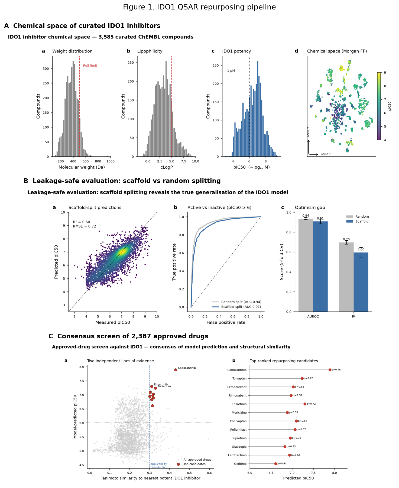

**Figure 2.** IDO1 versus TDO2 cross-target relationship. (A) The 684 compounds measured against both enzymes in ChEMBL, plotted by measured IDO1 versus measured TDO2 pActivity; the red line is the least-squares fit (Pearson *r* = 0.43, 95% CI 0.36–0.49, *p* ≈ 4 × 10⁻³²), a moderate positive correlation indicating overlapping inhibitor pharmacophores. Dotted guides mark the 1 µM (pActivity 6) and 100 nM (pActivity 7) pIC50-equivalent thresholds; 60% of sub-µM IDO1 inhibitors also inhibit TDO2 at sub-µM, falling to 20% at ≤100 nM. (B) Honest scaffold-split versus random-split model performance for both targets; the low TDO2 scaffold R² (0.40) is why the cross-target correlation is measured from data (panel A) rather than inferred from model predictions.

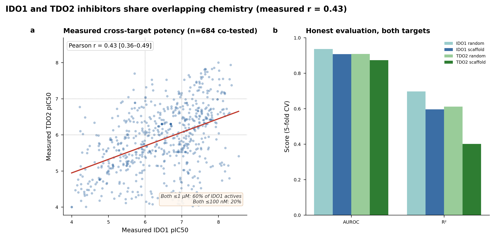

**Figure 3.** Structure-based confirmation in the haem-containing IDO1 pocket (PDB 6E40). (A) Docking affinity by role: known potent inhibitors (mean −10.11 kcal/mol) separate from decoys (−6.82; one-sided exact Mann–Whitney *p* = 3.3 × 10⁻⁴), with repurposing candidates (−9.27) overlapping the actives. (B) Contacts each candidate shares with the crystallographic epacadostat pose (16 total); nine of ten candidates share 10–12. (C) Percentage of epacadostat contacts recovered versus total IDO1 contacts per candidate; conivaptan illustrates that a strong docking score and canonical pocket engagement are distinct axes — it scores well (−9.5 kcal/mol) yet recovers only 29% of epacadostat's contacts, the lone outlier. The recurring consensus residues (Phe163, Phe226, Arg231, Tyr126, Ser263, Leu234) coincide with the crystallographically characterised IDO1 inhibitor pocket [6], spanning the A/S1 region and adjacent B/S2-side residues.

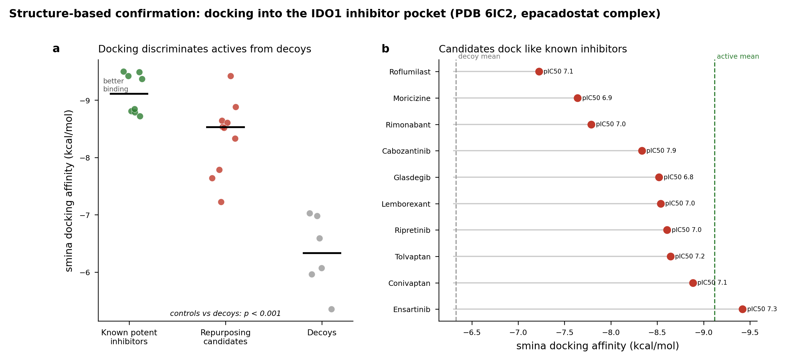

**Figure 4.** Ray-traced view of the haem-containing IDO1 inhibitor pocket (PDB 6E40). Ensartinib (firebrick sticks, docked) and epacadostat (tan sticks, crystal reference) occupy the same cleft of IDO1 (grey cartoon), adjacent to the ferric haem cofactor (orange) and its catalytic iron (red sphere); consensus contact residues (blue: Phe163, Phe226, Arg231, Tyr126, Ser263, Leu234) line the pocket. Rendered with PyMOL.

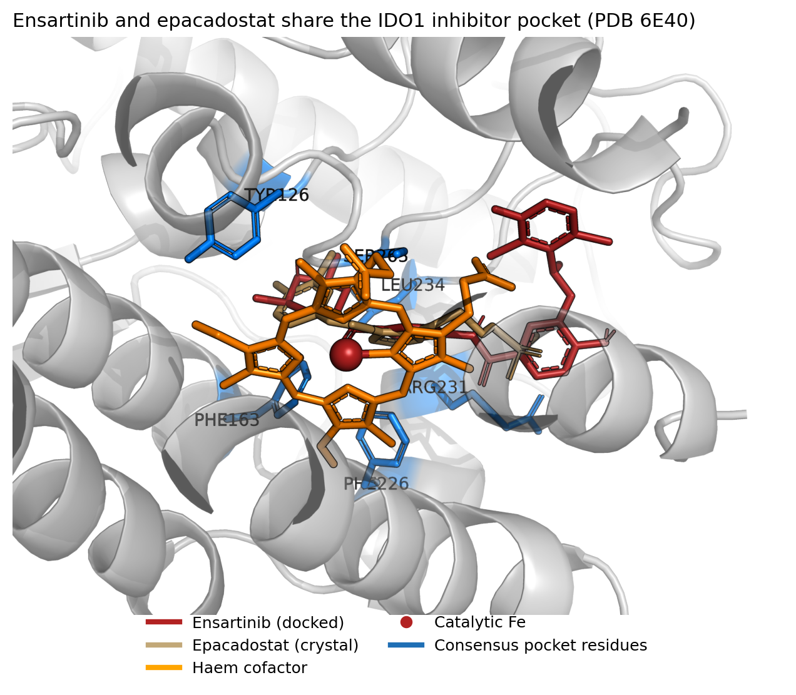

**Figure S1.** Measurement provenance of the 684 co-tested compounds, supporting the *r* = 0.43 estimate. (A) The cross-target correlation is robust to data source — it persists when the largest single document is excluded (*r* = 0.34) and is at least as strong within that document alone (*r* = 0.58), where measurements share one protocol. The elevated within-document value may reflect measurement homogeneity, a more congeneric series, or both; either way, pooling across sources does not manufacture the *r* = 0.43 signal. (B) Provenance summary: the set spans dozens of assays and documents over 2009–2025, is 95–97% IC50, and has both enzyme values from the same document for 99% of compounds.

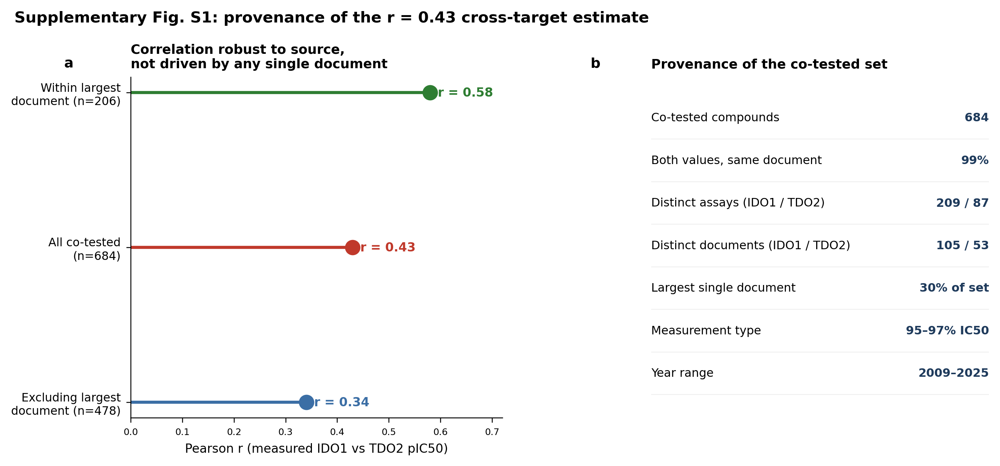

**Table 1.** Top-ranked in-domain IDO1 repurposing candidates with predicted pActivity, active probability, nearest-neighbour Tanimoto to known actives, docking affinity, and approved indication / primary pharmacology. Ranks 11, 16 and 18 (larotrectinib, gefitinib, trametinib) were not in the docking set and are marked ND. Formatted table provided as `table1_candidates.csv`; full numeric data with first-approval years as `top_candidates_integrated.csv`.

**Figure 5.** Paired M/D reparametrisation of the 684 co-tested compounds. (A) Distribution of shared potency *M* = (pActivity_IDO1 + pActivity_TDO2)/2. (B) Selectivity imbalance *D* = pActivity_IDO1 − pActivity_TDO2 versus *M*; the shaded band marks the balanced-dual region |D| ≤ 1 (within 10-fold on both enzymes), which contains 63% of compounds. Points coloured by balanced (green), IDO1-biased (red), TDO2-biased (purple).

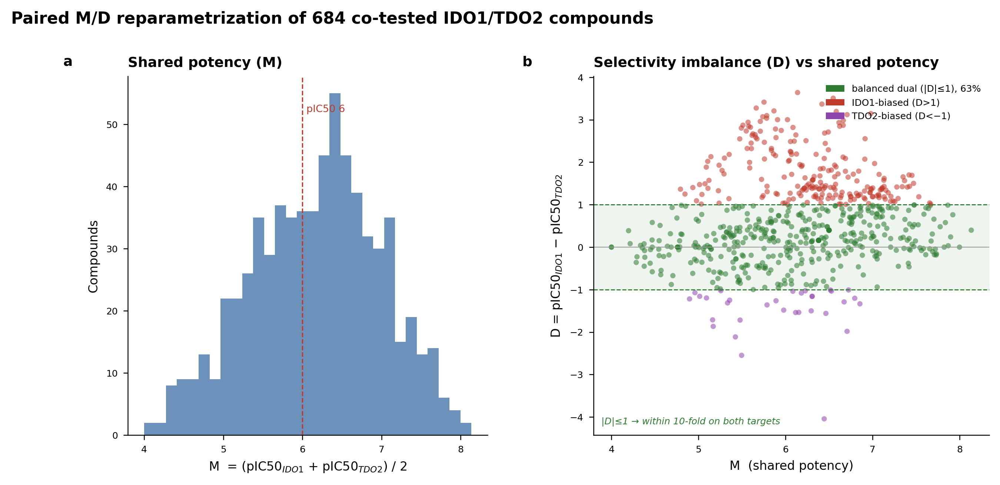

**Figure 6.** Split-hardness ladder. Global out-of-fold R² for the *M* (A) and *D* (B) models under five increasingly strict evaluation schemes — random, Murcko scaffold, Butina cluster, chemical-space (UMAP) cluster, and temporal. R² degrades from ~0.64 (random) to negative values under chemical-space and temporal extrapolation; negative R² indicates prediction worse than the training mean. Temporal test n = 284.

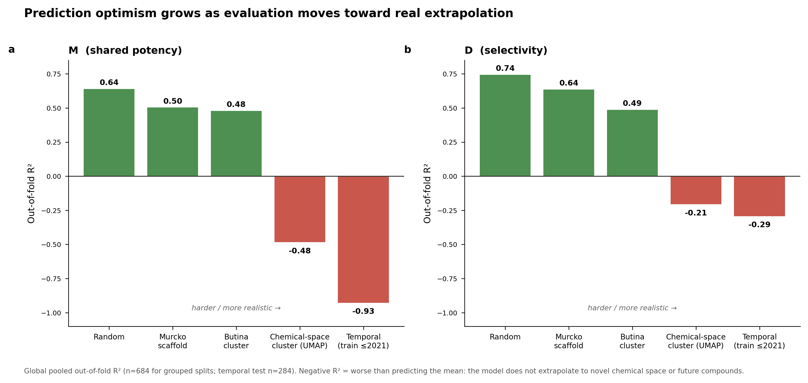

**Figure 7.** Leave-document-out validation. (A) Global pooled out-of-fold R² under random, scaffold, and leave-one-document-out splitting for *M* and *D*; document-level generalisation (0.03 / −0.05) is far worse than scaffold-level (0.50 / 0.64). (B) Per-document RMSE for *M* versus the number of compounds in each held-out document (marker size ∝ n), with the global pooled RMSE marked.

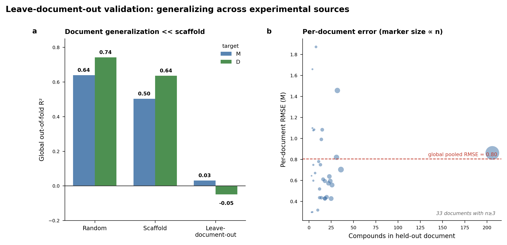

**Figure 8.** Split-conformal prediction with paired M/D residual sampling. (A) Reconstructed IDO1 predictions with 90% conformal intervals against observed pActivity (test fold). (B) Empirical versus nominal coverage for *M*, *D*, and the reconstructed IDO1/TDO2 predictions; curves track the ideal diagonal, confirming calibration.

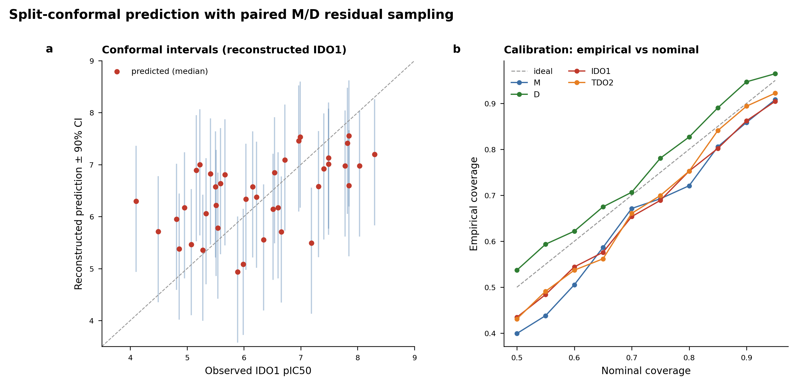

**Figure 9.** Conformal lower-bound re-ranking of the approved-drug deck. (A) Original consensus rank versus conformal LCB rank; the top point-estimate hits (red) are demoted to the bottom of the LCB ranking. (B) LCB_dual versus applicability-domain similarity to the 684 dual-tested compounds; no approved drug clears the pActivity 6 confident-dual bound (dashed line), an honest negative. The conformal offset is near-constant, so the low bounds reflect deflated point predictions for out-of-domain chemistry rather than widened intervals.

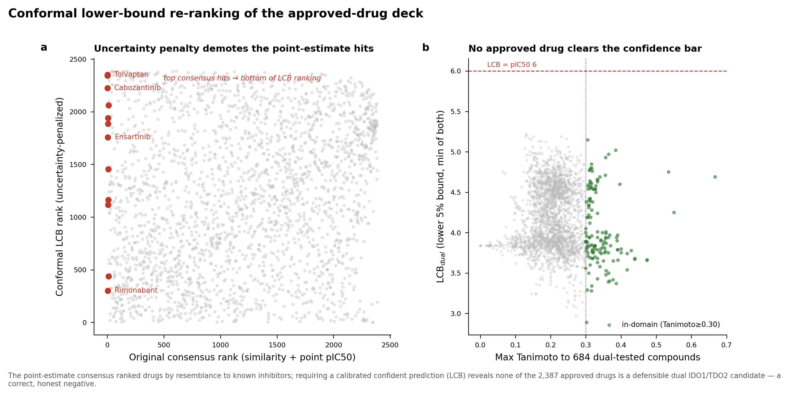

**Figure 10.** Matched molecular pair design rules. (A) R-group transformations (observed in ≥ 3 matched pairs) that most raise shared potency ΔM. (B) Each transformation as a point in (ΔIDO1, ΔTDO2) space, coloured by ΔD and sized by pair count; points on the diagonal tune potency without changing balance, off-diagonal points are selectivity levers.

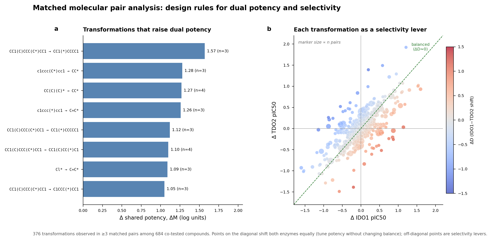

**Figure 11.** Provenance-Adaptive Conformal Ranking (PACR). (A) 90% IDO1 interval width versus applicability-domain distance for standard split-conformal (grey), RF-normalized conformal (green), and PACR (blue); PACR adds a learned source-document multiplier and widens most strongly for distant compounds. (B) Empirical coverage by AD-distance quartile. (C) Empirical coverage by source-document domain-distance quartile; PACR is conservative on the far document-domain quartile. (D) Deck LCB_dual under RF-normalized conformal versus PACR, coloured by document-domain distance; no drug crosses the confident-dual bound (red), and the honest negative is preserved.

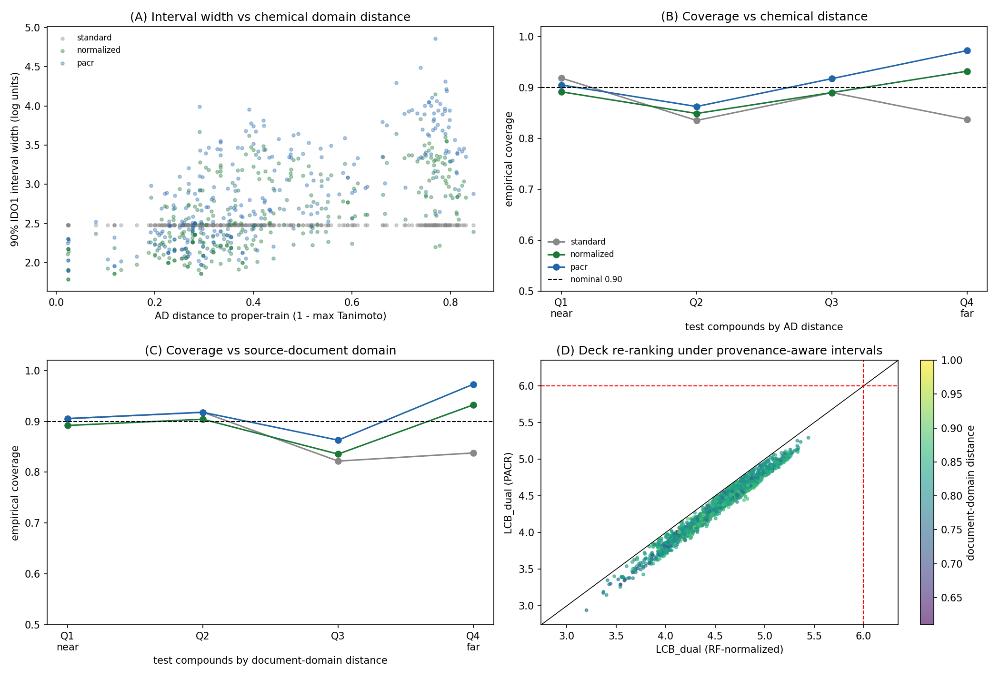

**Figure S2.** PACR sensitivity and ablation. Across five scaffold-disjoint split seeds, PACR variants are compared against standard split-conformal and RF-normalized conformal baselines. (A) Mean IDO1 marginal coverage. (B) Far source-document-domain quartile coverage, where standard split-conformal under-covers most strongly. (C) Maximum approved-drug LCB_dual; all methods remain below the pActivity 6 confident-dual threshold. (D) Tail-quantile sensitivity for PACR chem+doc: increasing τ from 0.65 to 0.80 acts as a monotonic conservatism knob, increasing coverage while lowering the maximum deck lower bound.

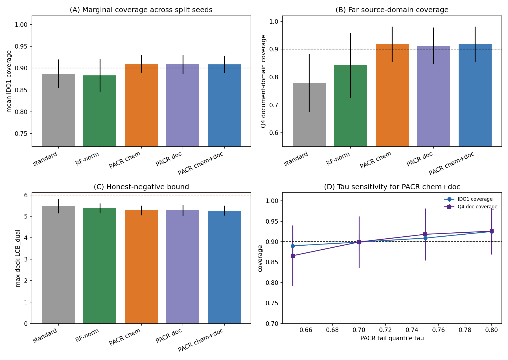

**Table S1.** PACR sensitivity summary across split seeds, tail quantiles and feature ablations. The full table is provided as `extensions/ext1_pacr_sensitivity_summary.csv`, with row-level results in `extensions/ext1_pacr_sensitivity.csv`. Across every split seed, τ setting and PACR ablation, zero approved drugs clear the pActivity 6 confident dual-active bound.

**Figure 12.** Model-independence of the leave-one-document-out collapse. Pooled global R² for shared potency *M* under random 5-fold, scaffold GroupKFold, and leave-one-document-out splitting, for eight representation × learner combinations (Morgan/RDKit-descriptor/MACCS/ChemBERTa × random-forest/gradient-boosting/ridge). Every method succeeds under random and scaffold splitting and collapses under LODO (maximum LODO R² 0.11); the pretrained ChemBERTa embedding does not rescue generalisation.

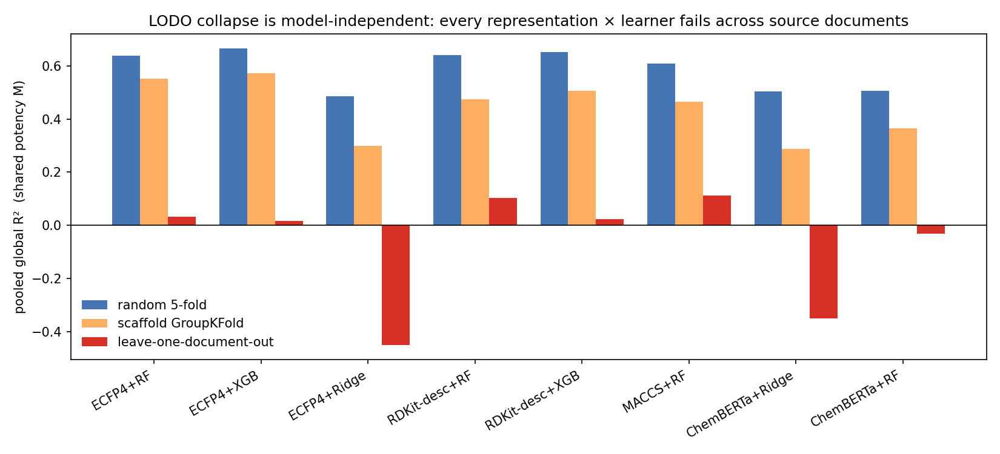

**Figure 13.** Second target-pair validation on COX-1/COX-2. (A) The 1,379 compounds measured against both enzymes in ChEMBL, plotted by measured COX-1 versus COX-2 pActivity; the red line is the least-squares fit (Pearson *r* = 0.28, 95% CI 0.23–0.33). (B) Split-hardness ladder for *M* and *D* (random, scaffold, leave-one-document-out): the same monotonic scaffold→document-level decay seen for IDO1/TDO2 reappears on the independent pair.

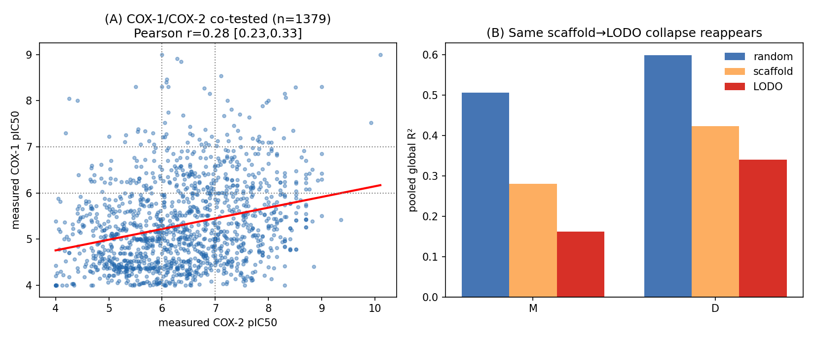

---

## Data and code availability

All analysis used public ChEMBL bioactivity data and open-source tools (RDKit, scikit-learn, smina). Curated datasets, ranked candidate lists, trained models, docking outputs, and figures are provided as supplementary artifacts. Framework outputs include the paired M/D dataset (`data/paired_MD_dataset.csv`), split-hardness and leave-document-out results (`data/split_hardness.csv`, `data/lodo_results.csv`), conformal calibration (`data/conformal_calibration.csv`), the conformal deck ranking (`data/dual_conformal_ranked.csv`), matched-pair transformations (`data/mmp_transformations.csv`), and the conformal M/D models with calibration residuals (`models/md_conformal_models.joblib`).

A self-validating reconstruction of the complete pipeline is provided in `src/` (stages `s1_curate` through `s6_mmp`, orchestrated by `src/run_all.sh`): it rebuilds curation, features, models, the repurposing screen, the split-hardness/LODO/conformal analysis, and the MMP transformations directly from the cached raw ChEMBL bioactivity, and each stage checks its output against the committed artifacts (curation reproduces exactly; model AUROC within 0.001; screen applicability-domain values within rounding; Butina clusters and LODO R² reproduced). The three additional analyses of §3.12–§3.14 are in `extensions/` with their own scripts, figures, and a results summary. A pinned `requirements.txt` and a top-level `README.md` document the environment and the artifact map.

## References

1. Long GV, Dummer R, Hamid O, *et al.* Epacadostat plus pembrolizumab versus placebo plus pembrolizumab in patients with unresectable or metastatic melanoma (ECHO-301/KEYNOTE-252): a phase 3, randomised, double-blind study. *Lancet Oncol.* 2019;20(8):1083–1097. doi:10.1016/S1470-2045(19)30274-8.
2. Platten M, Nollen EAA, Röhrig UF, Fallarino F, Opitz CA. Tryptophan metabolism as a common therapeutic target in cancer, neurodegeneration and beyond. *Nat. Rev. Drug Discov.* 2019;18(5):379–401. doi:10.1038/s41573-019-0016-5.
3. Munn DH, Mellor AL. Indoleamine 2,3-dioxygenase and tumor-induced tolerance. *J. Clin. Invest.* 2007;117(5):1147–1154. doi:10.1172/JCI31178.
4. Opitz CA, Litzenburger UM, Sahm F, *et al.* An endogenous tumour-promoting ligand of the human aryl hydrocarbon receptor. *Nature* 2011;478(7368):197–203. doi:10.1038/nature10491.
5. Pilotte L, Larrieu P, Stroobant V, *et al.* Reversal of tumoral immune resistance by inhibition of tryptophan 2,3-dioxygenase. *Proc. Natl. Acad. Sci. USA* 2012;109(7):2497–2502. doi:10.1073/pnas.1113873109.
6. Lewis-Ballester A, Pham KN, Batabyal D, *et al.* Structural insights into substrate and inhibitor binding sites in human indoleamine 2,3-dioxygenase 1. *Nat. Commun.* 2017;8:1693. doi:10.1038/s41467-017-01725-8.
7. Mendez D, Gaulton A, Bento AP, *et al.* ChEMBL: towards direct deposition of bioassay data. *Nucleic Acids Res.* 2019;47(D1):D930–D940. doi:10.1093/nar/gky1075.
8. Bemis GW, Murcko MA. The properties of known drugs. 1. Molecular frameworks. *J. Med. Chem.* 1996;39(15):2887–2893. doi:10.1021/jm9602928.
9. Baell JB, Holloway GA. New substructure filters for removal of pan assay interference compounds (PAINS) from screening libraries and for their exclusion in bioassays. *J. Med. Chem.* 2010;53(7):2719–2740. doi:10.1021/jm901137j.
10. Rogers D, Hahn M. Extended-connectivity fingerprints. *J. Chem. Inf. Model.* 2010;50(5):742–754. doi:10.1021/ci100050t.
11. Breiman L. Random forests. *Mach. Learn.* 2001;45(1):5–32. doi:10.1023/A:1010933404324.
12. Pedregosa F, Varoquaux G, Gramfort A, *et al.* Scikit-learn: machine learning in Python. *J. Mach. Learn. Res.* 2011;12:2825–2830.
13. Landrum G. RDKit: Open-source cheminformatics. https://www.rdkit.org.
14. Butina D. Unsupervised data base clustering based on daylight's fingerprint and Tanimoto similarity: a fast and automated way to cluster small and large data sets. *J. Chem. Inf. Comput. Sci.* 1999;39(4):747–750. doi:10.1021/ci9803381.
15. McInnes L, Healy J, Melville J. UMAP: Uniform Manifold Approximation and Projection for dimension reduction. *arXiv* 2018;1802.03426. doi:10.48550/arXiv.1802.03426.
16. Trott O, Olson AJ. AutoDock Vina: improving the speed and accuracy of docking with a new scoring function, efficient optimization, and multithreading. *J. Comput. Chem.* 2010;31(2):455–461. doi:10.1002/jcc.21334.
17. Koes DR, Baumgartner MP, Camacho CJ. Lessons learned in empirical scoring with smina from the CSAR 2011 benchmarking exercise. *J. Chem. Inf. Model.* 2013;53(8):1893–1904. doi:10.1021/ci300604z.
18. Vovk V, Gammerman A, Shafer G. *Algorithmic Learning in a Random World.* Springer; 2005. doi:10.1007/b106715.
19. Papadopoulos H, Proedrou K, Vovk V, Gammerman A. Inductive confidence machines for regression. In: *Machine Learning: ECML 2002.* Springer; 2002:345–356. doi:10.1007/3-540-36755-1_29.
20. Hussain J, Rea C. Computationally efficient algorithm to identify matched molecular pairs (MMPs) in large data sets. *J. Chem. Inf. Model.* 2010;50(3):339–348. doi:10.1021/ci900450m.
21. Sheridan RP. Time-split cross-validation as a method for estimating the goodness of prospective prediction. *J. Chem. Inf. Model.* 2013;53(4):783–790. doi:10.1021/ci400084k.

## Acknowledgements

This work was carried out by the author, who designed the study, performed the computational analysis, and interpreted the results.
